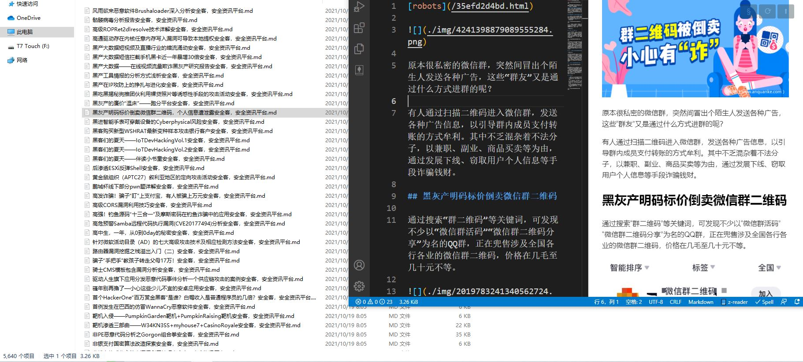

## 前言
某次CTF线下比赛断网,想着搞点资料,而后参考了书鱼大佬的代码,搞了一套获取资料的小工具。
### 在原作者的基础上补充了安全客,freebuf,seebug完善了先知的部分代码
原作者项目地址 https://github.com/bkfish/html2markdown_Spider

### 参数说明
- -s 需要查找的关键字，空代表按时间顺序爬取
- -c 需要文章的数目，默认30
- -p 是否需要建立本地图床，默认0 0代表不需要 1代表需要


### 安装使用
安装如下
```bash
git clone https://github.com/qiannianshuangxue/safe_message_spider
cd xianzhiSpider
pip install -r requirements.txt
```

#### 先知
使用前注意设置headers的cookie
```
python3 xianzhiSpider.py -s CTF -c 5 -p 1
```
#### seebug
无需使用其他参数
```
python3 seebug_Spider.py
```
#### freebuf
无需使用其他参数
```
python3 freebufSpider.py
```
#### anquanke
无需使用其他参数
```
python3 anquankeSpider.py
```
### 查看下载的文档
由于我个人习惯使用VSCODE来查看以及搜索关键词,因此并没有开发一套查看工具。

### 结果
包括图床一共也只有26个G左右

效果图如下


仅供学习，禁止商用行为